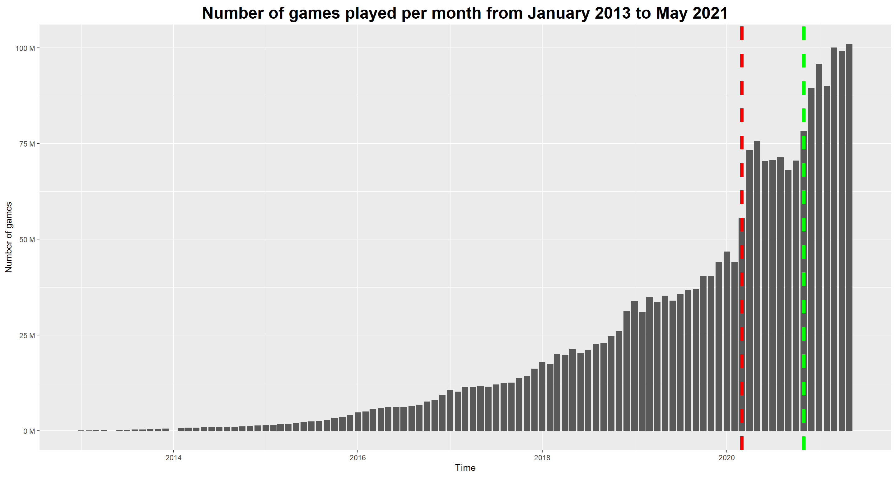
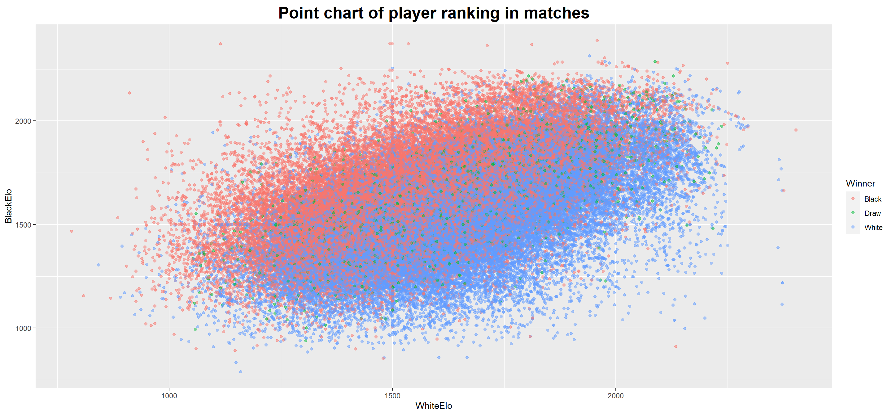
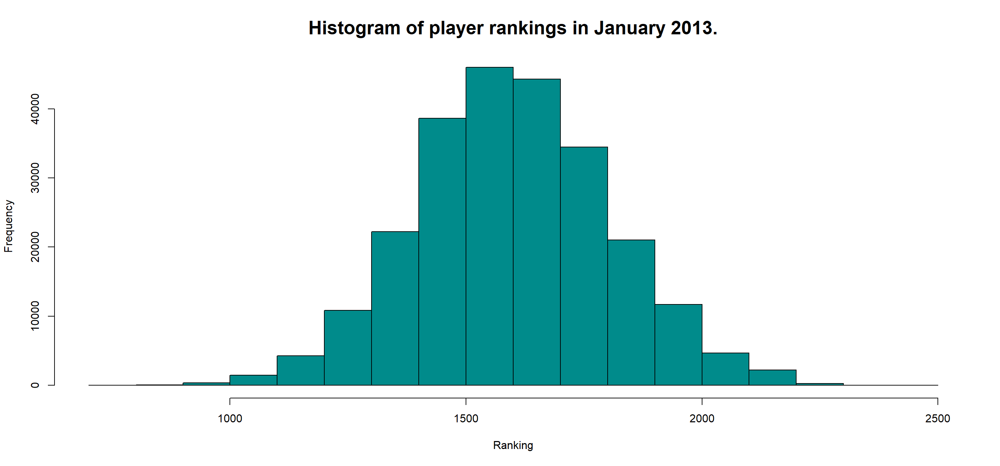
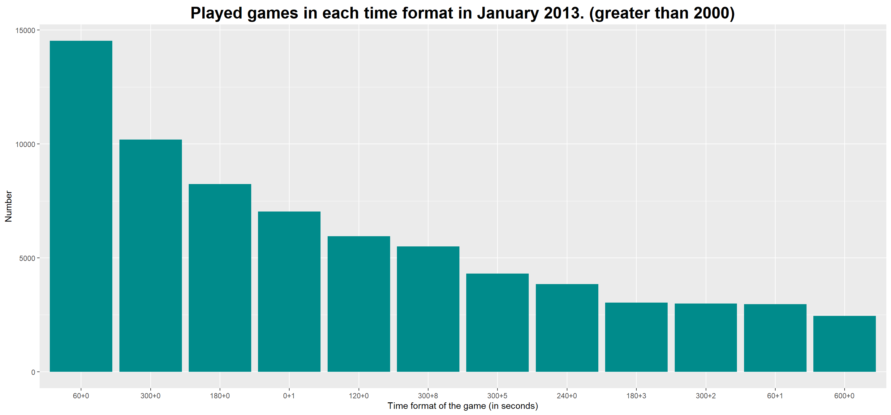
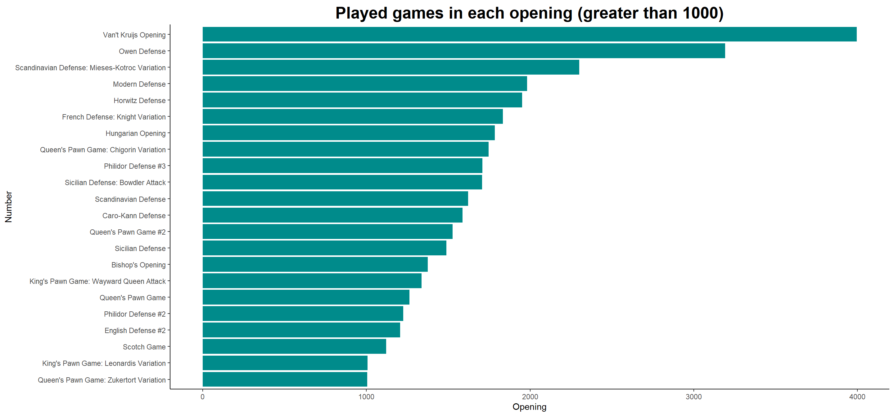
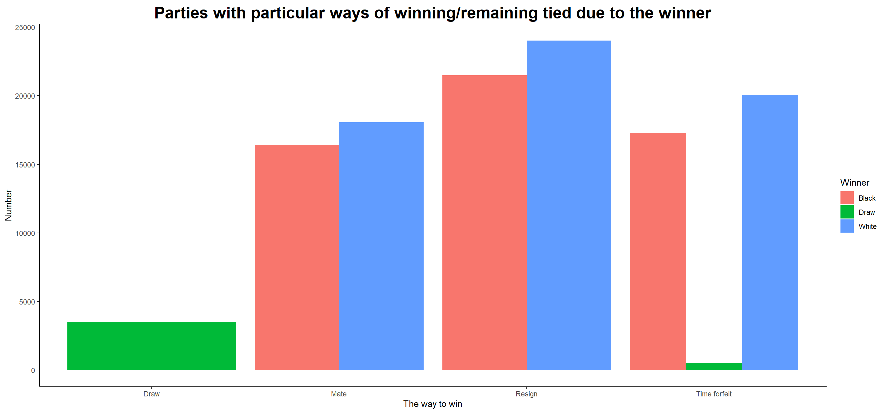
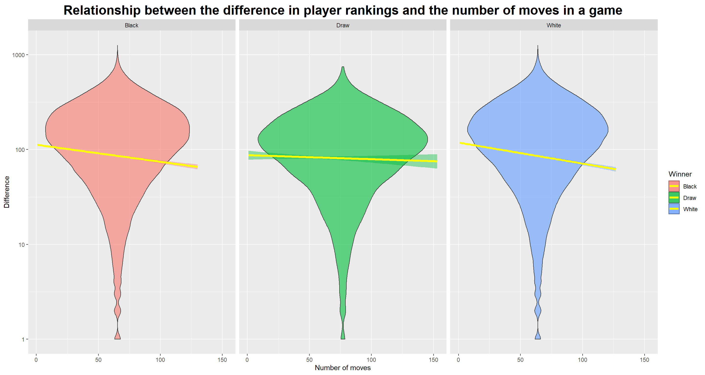
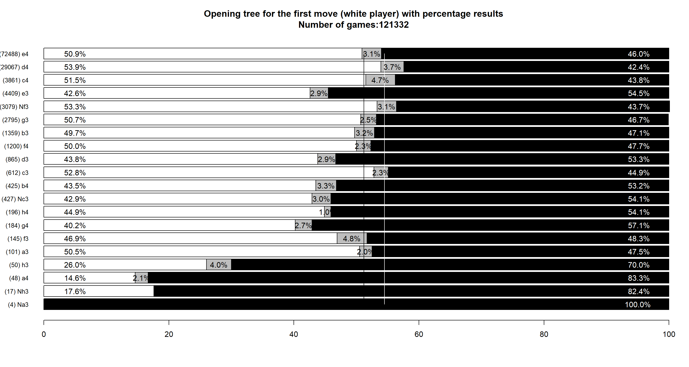

# Chess-Data-Analysis

## Table of Contents

- [General info](#general-info)
- [Technologies](#technologies)
- [Code](#code)
- [Contact](#contact)

## General info


I decided to create a project about chess, since I have been interested in chess for some time. Therefore, I downloaded a base from one of the well-known chess sites Lichess.org, which provides for free all the games that have been played in the following months from 2013 until this year. At [@Lichess Database](https://database.lichess.org/) you can download all the bases. I chose the one from January 2013 because the file is the smallest(after unzipping it is **90MB**), I also downloaded the file from April 2021 out of sheer curiosity. It turned out that after unzipping it has **142GB**, so I stayed with 90MB :) The entire number of games that are in our database after downloading is **121332**.

[@Direct link to database](https://database.lichess.org/standard/lichess_db_standard_rated_2013-01.pgn.bz2)

## Technologies

Project is created in R using those packets:

- bigchess
- knitr
- tidyr
- rdrr
- ggplot2
- forecast
- scales


**Direct link to data: https://database.lichess.org/standard/lichess_db_standard_rated_2013-01.pgn.bz2**

## Code

#### First I will load all the libraries I need.

```r
#I skip installing all the packages
library(bigchess)
library(knitr)
library(data.table)
library(hms) # Time handling, here I read that you can use the hms library
library(dplyr) # Library to count depending on the opening(Similar to GROUP BY in MySQL). I have used many interesting functions from this package, e.g. top_n, mutate, separate.
library(ggplot2)
library(forecast)
library(tidyr)
library(scales)
library(rmarkdown)
```

### I proceed to load the data.

#### Chess parties have a special .pgn. format and a specific data layout. Therefore, to import the data, I had to use a function from a dedicated package.
```r
#I had to list all the tags here, because read.pgn persistently omitted several important columns.
chess_games <- read.pgn("C:/Users/Mateusz/Desktop/project/lichess_db_standard_rated_2013-01.pgn",add.tags = c("UTCDate", "UTCTime", "WhiteElo",  "BlackElo", "WhiteRatingDiff", "BlackRatingDiff", "ECO", "Opening","TimeControl", "Termination"))
```

```r
# I convert data.frame to data.table.
setDT(chess_games)

# Cleaning from NA.
na.omit(chess_games)

# I remove the empty Date, Round and complete.movetext rows, which contributed nothing to the data. We have UTCDate and UTCTime columns instead.
chess_games <- subset(chess_games, select = -c(Date, Round, complete.movetext ))

#Converting to correct date format.
chess_games$UTCDate <- as.Date(chess_games$UTCDate, format="%Y.%m.%d")

# Checking that the column now "sees" the date correctly.
class(chess_games$UTCDate)

# Conversion to the correct time format.
chess_games$UTCTime <- as.hms(chess_games$UTCTime)

# Re-check the time format.
class(chess_games$UTCTime)
```
#### Below is an example of what our imported data looks like. There are as many as **56** columns. Use the arrow to see more columns.

```r
paged_table(chess_games, options = list(rows.print=15,max.print=15))
```
#### Everything is fine, but for optimization reasons, each table in the preview will be limited to 15 rows.

***

#### We tabulate the Result variable and thus see how many wins, draws and losses there were.
```r
table(chess_games$Result)

# This gives a total of 121332 games, which is exactly what it should be.
sum(table(chess_games$Result))
```

#### Here is an interesting situation, because R displayed at this time ("Error in the command 'order(NMoves)':object 'NMoves' not found").Now this command works, but I dealt with it in yet another way - with the command **setDT**, which I already displayed earlier.

```r
## I sort descending by number of moves and put the 10 games with the most moves into a table.
max_moves<-as.data.frame(chess_games[order(-chess_games$NMoves)[1:10],])

# I trim to the columns that interest me.
max_moves<-max_moves[c("Event","White","Black","Result","UTCDate","UTCTime","WhiteElo","BlackElo","NMoves")]
paged_table(max_moves, options = list(rows.print=15,max.print=15))
```

#### Displaying, interestingly there were 2 matches in which the players made as many as **153 moves**.

***

#### I analyze Blitz ranking games, in which white's ranking is greater than 2000, there were 1152 such games.
```r
white_2k<-as.data.frame(chess_games[chess_games$Event=='Rated Blitz game' & chess_games$WhiteElo>2000,])
# I trim to the columns that interest me.
white_2k<-white_2k[c("White","Black","Result","UTCDate","UTCTime","WhiteElo","BlackElo")]
paged_table(white_2k, options = list(rows.print=15,max.print=15))
```

***

#### I analyze Bullet ranking games, in which black's ranking is greater than 2300, there were only 7 such games.
```r
black_2300<-as.data.frame(chess_games[chess_games$Event=='Rated Bullet game' & chess_games$BlackElo>2300,])
# I trim to the columns that interest me.
black_2300<-black_2300[c("White","Black","Result","UTCDate","UTCTime","WhiteElo","BlackElo")]
paged_table(black_2300, options = list(rows.print=15,max.print=15))
```

***

```r
# Counting the average number of ranking points of white pieces players.
mean(chess_games$WhiteElo,na.rm=T)

# And here is the average number of ranking points of black pieces players
mean(chess_games$BlackElo,na.rm=T)

# ELO points average of white and black due to opening.
means <- chess_games[order(Opening),.(white_mean=mean(WhiteElo,na.rm=T),black_mean=mean(BlackElo,na.rm=T)),by=Opening] 

means <-means[order(-white_mean)] # Decreasing average of openings for whites.
paged_table(means, options = list(rows.print=15,max.print=15))

means <-means[order(-black_mean)]#Decreasing average of openings for blacks.
paged_table(means, options = list(rows.print=15,max.print=15))
```

***

#### We will now check which opening was played most often and which was played least often.
```r
chess_games %>% count(Opening,sort=T,name="Count")
```


#### We can see that Van't Kruijs' opening was the most played: **3995 times**. And only **1 time** was the opening played: Zukertort Opening: The Walrus. Unsurprisingly, this is a rather unusual opening for match.


# What are these openings?

## Van't Kruijs Opening


## Zukertort Opening: The Walrus


***

#### It is worth noting here how much the game has changed. It is very possible that in January 2013 it was popular to play Van't Kruijs. Now, at least according to Lichess.org data, the most popular opening is **Sicilian Defense: Open**.


***

#### I used the **top_n** function. We can see how many times each game format has been played, I only displayed 4 because the others are tournament games, of which there are about 150.
```r
top_n(chess_games %>% count(Event,sort=T,name="Count"),4)
```

#### I am importing a table regarding the number of games played over months on Lichess.org. I had to prepare the data in Excel beforehand.

```r
games<-read.csv(file="C:/Users/Mateusz/Desktop/project/games.csv", sep=",",header = TRUE, fileEncoding="UTF-8-BOM")
#games$date <- paste(games$Year, games$Month, sep="-")
games$Date <- as.Date(games$Date, origin = "1899-12-30")
```

#### Below is a sample of what our imported data looks like.

```r
paged_table(games, options = list(rows.print=15,max.print=15))
```

***

```r
ggplot(
    games, aes(y=Amount.of.games, x=Date))+ geom_bar(stat = "identity") +
    ggtitle("Number of games played per month from January 2013 to May 2021") +
    theme(
        plot.title=element_text( hjust=0.5, vjust=0.5, face='bold', size = 20,family = 'Raleway'))+
    xlab("Time") + ylab("Number of games")+expand_limits( y = c(0, NA)) +
    scale_y_continuous(labels = unit_format(unit = "M", scale = 1e-6)) + geom_vline(xintercept=as.numeric(games$Date[15]), linetype=2, lwd=2, colour="red") + geom_vline(xintercept=as.numeric(games$Date[7]), linetype=2, lwd=2, colour="green")
```




### The red line is **$\color{red}{\text{the beginning of a pandemic}}$**, the green line is **$\color{green}{\text{series premiere}}$** Queen's Gambit on Netflix..


***

```r
chess_games %>%
    select(UTCDate)%>% count(UTCDate, sort = TRUE)->games_per_day

games_per_day <- games_per_day[-c(32),] # I am removing the date 2012.12.31 due to incorrect data.
games_per_day <- games_per_day %>% separate(UTCDate, c(NA, NA,"Day"))
```

```r
ggplot(
    games_per_day, aes(y=n, x=Day))+ geom_bar(stat = "identity") +
    ggtitle("Number of games played by day in January 2013.") +geom_col(fill = "darkcyan")+
    theme(plot.title=element_text( hjust=0.5, vjust=0.5, face='bold', size = 20,family = 'Raleway'))+ xlab("Day of the month") + ylab("Number of games")
```


***
#### I add a Winner column. The mutate command checks the contents in Result one at a time and prints out the winner of that match.
```r
#mutate(test1, Winner = ifelse(chess_games$Result =="1:0", "White",
#                                     ifelse(chess_games$Result =="0:1", "Black",
#                                            ifelse(chess_games$Result =="1/2-1/2", "Draw"))))

chess_games<-mutate(chess_games, Winner = ifelse(chess_games$Result =="1-0", "White",ifelse(chess_games$Result =="0-1", "Black",ifelse(chess_games$Result =="1/2-1/2", "Draw","false"))),.after="Result")
```


```r
ggplot(chess_games,aes(x=WhiteElo,y=BlackElo,color=Winner))+ggtitle("Point chart of player ranking in matches")+geom_point(alpha=0.5)+theme(plot.title=element_text( hjust=0.5, vjust=0.5, face='bold', size = 20,family = 'Raleway'))
```


***

```r
rating<-rbind(chess_games$WhiteElo,chess_games$BlackElo)
hist(rating,angle = 45, col = "darkcyan", border = "black", main = "Histogram of player rankings in January 2013.", xlab = "Ranking",cex.main=1.7) # Creating a histogram.
```



***

#### As you can see, the most frequently played modes were 1-minute, 5-minute and 3-minute.
```r
increment<-filter(summarise(group_by(chess_games,TimeControl), count=length(TimeControl)),count>2000) # I count the games played in a certain time format, where the number is greater than 2000.
ggplot(increment,aes(x=reorder(TimeControl, -count),y=count))+theme(plot.title=element_text( hjust=0.5, vjust=0.5, face='bold', size = 20,family = 'Raleway'))+geom_col(fill = "darkcyan")+ggtitle("Played games in each time format in January 2013. (greater than 2000)")+
    xlab("Time format of the game (in seconds)") + ylab("Number")
```



***

```r
openings<-filter(summarise(group_by(chess_games,Opening), count=length(Opening)),count>1000) # I count the games played in a specific opening where the number is greater than 1000.
ggplot(openings,aes(x=reorder(Opening, count),y=count))+geom_col(fill = "darkcyan")+coord_flip()+theme_classic()+ggtitle("Played games in each opening (greater than 1000)")+theme(plot.title=element_text( hjust=0.5, vjust=0.5, face='bold', size = 20,family = 'Raleway'))+
    xlab("Number") + ylab("Opening")
```



***

#### Here is the **mutate** command again. It adds a Victory column that checks how the party ended. The order of the if's was important. If Termination == "Time Forfeit" it is a loss by time, if there was a "#" sign in Termination, it means ending by mate. If there was no "#" it means that the party ended by surrender.

```r
chess_games<-mutate(chess_games, Victory = ifelse(grepl("Time forfeit", chess_games$Termination), "Time forfeit",ifelse(grepl("1/2-1/2", chess_games$Result), "Draw", ifelse(grepl("#", chess_games$last.move), "Mate", ifelse(!grepl("#", chess_games$last.move), "Resign","false")))) ,.after="Termination")
```

```r
ggplot(chess_games,aes(x=Victory,fill=Winner))+geom_bar(position = "dodge")+theme_classic()+theme(plot.title=element_text( hjust=0.5, vjust=0.5, face='bold', size = 20,family = 'Raleway'))+ggtitle("Parties with particular ways of winning/remaining tied due to the winner")+xlab("The way to win") + ylab("Number")


```



***

### Following this graph, we can see that the white pieces win more often. This is because white is the one who starts the game first.
```r
#################
# chess_data[,  Game_type := factor(Game_type, levels = c("Bullet", "Blitz", "Rapid", "Classical"), ordered = T)]
# {r games by time control, echo = F}
# ggplot(chess_games[, .(chess_games$Site = .N), by = .(chess_games$Event, `Match category`)], aes(x = chess_games$Event, y = chess_games$Site, fill = `Match category`)) +
#    geom_col() +
#    scale_y_continuous(label = comma, expand = c(0.01, 0.01)) +
#    scale_fill_brewer(palette = "Set2") +
#    labs(title = "Games by time control") +
#    theme(axis.title.x = element_blank(),
#          panel.grid.major = element_blank(),
#          panel.grid.minor = element_blank())
# 
# 
# 
# 
# test3 <- matrix(,ncol=3,nrow=3,byrow=TRUE)
# game_type <- c("Bullet", "Blitz", "Classical")
# rating <- c("Low rating","High rating","GM rating")
# value <- abs(rnorm(12 , 0 , 15))
# test3 <- data.frame(game_type,rating ,value)
# ggplot(test3, aes(fill=rating, y=value, x=game_type )) +
#     geom_bar(position="stack", stat="identity")
#####################

```

```r
chess_games<-mutate(chess_games, Rating_diff =abs(chess_games$WhiteElo-chess_games$BlackElo) ,.after="BlackRatingDiff") # I count the absolute value from the difference in player rankings.

q <- ggplot(chess_games, aes(x = NMoves, y=(Rating_diff), fill=Winner))+scale_y_log10() +theme(plot.title=element_text( hjust=0.5, vjust=0.5, face='bold', size = 20,family = 'Raleway')) +
labs(title="Relationship between the difference in player rankings and the number of moves in a game",
         y="Difference",
         x="Number of moves") + geom_violin(alpha=.6) + geom_smooth(color="yellow", size=1.5, method="lm") + facet_wrap(~Winner)
q
```



It turns out that there is a small correlation between the difference in players' ranking and the number of moves in a game. For both colors of runners there is a negative correlation of the ranking difference depending on the number of moves which means that **as the number of moves increases, the ranking difference decreases**.

***

### Finally, I will show how all the first moves played in matches are distributed. As you can see, of course, the most popular first moves are:
+ The famous **e4**, which leads to open, more aggressive and tactical games.
+ Equally famous **d4** which leads to closed, more strategic parties.

```r
tree <- tree_move(chess_games,"W1")
plot_tree_move(tree,paste0("Opening tree for the first move (white player) with percentage results\n","Number of games:", sum(nrow(chess_games)),""))

```



### In addition to **lichess.org** and **chess.com**, I also learned from the following sites:

1. https://cran.r-project.org/web/packages/bigchess/bigchess.pdf
2. https://community.rstudio.com
3. https://stackoverflow.com - Section RStudio
4. https://github.com
5. https://tidyr.tidyverse.org
6. https://rdrr.io
7. https://www.r-graph-gallery.com
8. https://ggplot2.tidyverse.org
9. https://www.kaggle.com


**The theme used from the *rmdformats* package in the project is.: [*downcute*](https://juba.github.io/rmdformats/articles/examples/downcute.html) **
 

### Worth seeing

When it comes to chess topics, I recommend materials:

* Polish-language
    1. Dawid Czerw:
    
      Youtube: https://www.youtube.com/c/DawidCzerwTV
      Twitch TV: https://www.twitch.tv/dawidczerw
* English-language
    1. Hikaru Nakamura:
    
      Youtube: https://www.youtube.com/c/GMHikaru
      Twitch TV: https://www.twitch.tv/gmhikaru
    2. Levy Rozman:
    
      Youtube: https://www.youtube.com/c/GothamChess
      Twitch TV: https://www.twitch.tv/gothamchess


## Contact

Created by [@Mateusz Suszczyk](https://suszczyk.github.io) - feel free to contact me!